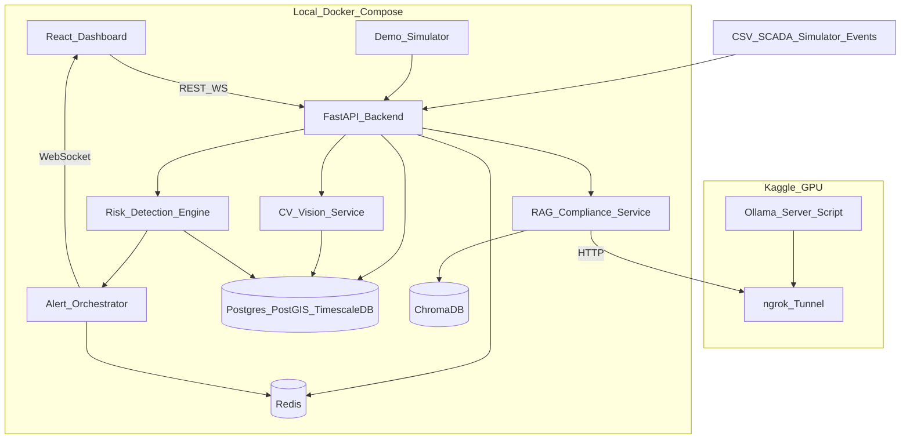
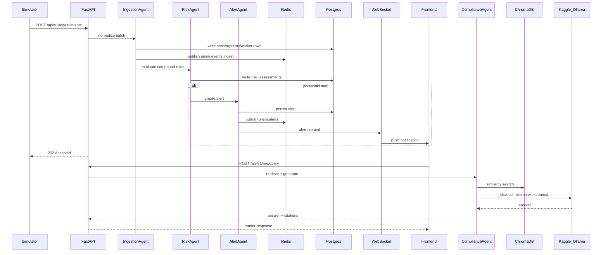
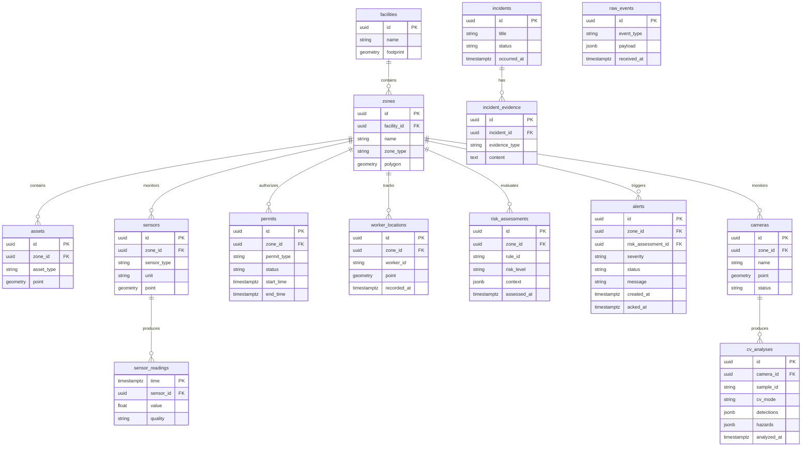

# PRISM — System Architecture

**Predictive Risk & Incident Safety Management System**

Living architecture document. Update this file when system structure or data flows change.

---

## Overview

PRISM is a Docker Compose–based industrial safety intelligence prototype. It ingests IoT/SCADA events, evaluates compound risk conditions, pushes real-time alerts, visualizes risk geospatially, and answers compliance questions via RAG backed by a remote LLM (Ollama on Kaggle, exposed through ngrok).

Multi-agent roles are implemented as Python modules under `backend/app/agents/` in v1 — not separate microservices.

---

## System Diagram



---

## Tech Stack

| Layer | Technology |
|---|---|
| Backend API | Python 3.12 + FastAPI |
| Database | PostgreSQL 16 + PostGIS + TimescaleDB |
| Cache / pub-sub | Redis 7 |
| Vector store | ChromaDB |
| Frontend | React 18 + TypeScript + Vite |
| Map | Leaflet + OpenStreetMap |
| LLM serving | Kaggle notebook + Ollama + ngrok |
| Orchestration | Docker Compose |
| Testing | pytest (backend), Vitest + Playwright (frontend) |

---

## Multi-Agent Logical Roles

Agents are orchestrated in the backend as Python modules, not separate services.

| Agent | Module | Responsibility |
|---|---|---|
| **IngestionAgent** | `backend/app/agents/ingestion.py` | Normalize sensor, permit, and worker events into canonical schema |
| **RiskAgent** | `backend/app/agents/risk.py` | Evaluate compound rules (e.g., hot work + gas spike + confined space) |
| **AlertAgent** | `backend/app/agents/alerts.py` | Dedupe, prioritize, route alerts, log actions |
| **ComplianceAgent** | `backend/app/agents/compliance.py` | RAG over SOPs, regulations, and incident reports via remote LLM |
| **VisionAgent** | `backend/app/agents/vision.py` | CCTV frame analysis — PPE/hazard detection (YOLOv8 or mock) |

---

## Agent Interaction Sequence



---

## Data Model Overview

### Core Entities



### Time-Series

`sensor_readings` is stored as a TimescaleDB hypertable partitioned on `time` for efficient range queries and latest-value lookups.

### Geospatial

PostGIS `geometry` columns on `facilities`, `zones`, `assets`, `sensors`, and `worker_locations` enable spatial queries (zone containment, permit boundary checks, map layer generation).

### Event Bus (Redis Topics)

| Topic | Purpose |
|---|---|
| `prism.events.ingest` | Published after each ingested event batch |
| `prism.alerts` | Alert lifecycle events |
| `prism.risk` | Risk level changes |

### WebSocket Events

Endpoint: `/ws/alerts`

| Event | Payload |
|---|---|
| `alert.created` | New alert with severity, zone, message |
| `alert.updated` | Status change (e.g., acknowledged) |
| `risk.changed` | Active risk level change for a zone |

---

## REST API (v1)

| Method | Path | Purpose |
|---|---|---|
| GET | `/api/v1/health` | Service health + LLM mode |
| POST | `/api/v1/ingest/events` | Batch event ingestion |
| GET | `/api/v1/sensors/latest` | Latest sensor readings |
| GET | `/api/v1/risk/active` | Active risk assessments |
| GET | `/api/v1/alerts/active` | Active alerts |
| POST | `/api/v1/alerts/ack` | Acknowledge alert |
| GET | `/api/v1/map/layers` | GeoJSON map layers (zones, sensors, workers, permits, cameras) |
| GET | `/api/v1/cv/samples` | Demo CCTV sample catalog |
| POST | `/api/v1/cv/analyze` | Frame analysis (mock or YOLOv8) |
| POST | `/api/v1/rag/query` | RAG compliance query |

WebSocket: `/ws/alerts` — `alert.created`, `alert.updated`, `risk.changed`

Full schemas: [`backend/api_contract.yaml`](../backend/api_contract.yaml)

---

## Repository Layout

```
PRISM/
├── backend/
│   ├── api_contract.yaml
│   ├── app/
│   │   ├── agents/          # Ingestion, Risk, Alert, Compliance, Vision
│   │   ├── ingestion/
│   │   ├── risk/
│   │   ├── alerts/
│   │   ├── rag/
│   │   ├── cv/
│   │   ├── map/
│   │   ├── models/
│   │   └── api/
│   ├── data/knowledge/      # RAG seed docs
│   ├── data/cv_samples/     # Demo CCTV frames
│   ├── tests/unit/
│   ├── tests/integration/
│   └── scripts/validate_contract.py
├── frontend/
│   ├── src/pages/           # Dashboard, SafetyMap, Incidents
│   ├── src/components/
│   ├── e2e/                 # Playwright smoke tests
│   └── playwright.config.ts
├── simulator/scenarios/
├── kaggle/
├── docs/
│   ├── architecture.md
│   ├── DEMO_RUNBOOK.md
│   └── user-flows/
├── scripts/run_all_tests.ps1
├── docker-compose.yml
└── README.md
```

---

## Repository Layout (legacy reference)

<details>
<summary>Original Phase 0 layout (superseded by above)</summary>

```
PRISM/
├── backend/
│   ├── api_contract.yaml          # Single source of truth
│   ├── app/
│   │   ├── main.py
│   │   ├── config.py
│   │   ├── agents/
│   │   ├── ingestion/
│   │   ├── risk/
│   │   ├── alerts/
│   │   ├── rag/
│   │   ├── models/
│   │   └── api/
│   ├── tests/
│   ├── Dockerfile
│   └── requirements.txt
├── frontend/
│   ├── src/
│   │   ├── pages/
│   │   ├── components/
│   │   └── api/
│   ├── tests/
│   ├── Dockerfile
│   └── package.json
├── simulator/
│   ├── scenarios/
│   └── run_simulator.py
├── kaggle/
│   ├── ollama_ngrok_server.ipynb
│   └── README.md
├── docs/
│   ├── architecture.md
│   └── user-flows/
├── docker-compose.yml
├── .env.example
└── README.md
```

</details>

---

## Shared Constants

Defined in `backend/api_contract.yaml`:

- **Risk levels:** `LOW` | `MEDIUM` | `HIGH` | `CRITICAL`
- **Alert statuses:** `ACTIVE` | `ACKNOWLEDGED` | `RESOLVED`
- **Event types:** `sensor_reading` | `permit_update` | `worker_location`
- **CV hazard colors:** `normal` | `warning` | `critical`

---

## Document History

| Date | Change |
|---|---|
| 2026-07-02 | Initial architecture document (Phase 0) |
| 2026-07-03 | Added VisionAgent, CV pipeline, cameras entity, REST table, demo runbook refs (Phase 7) |
