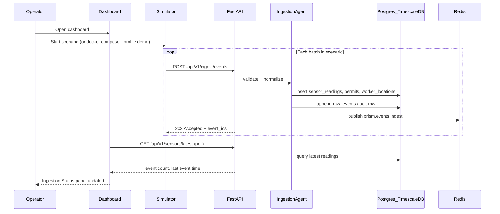
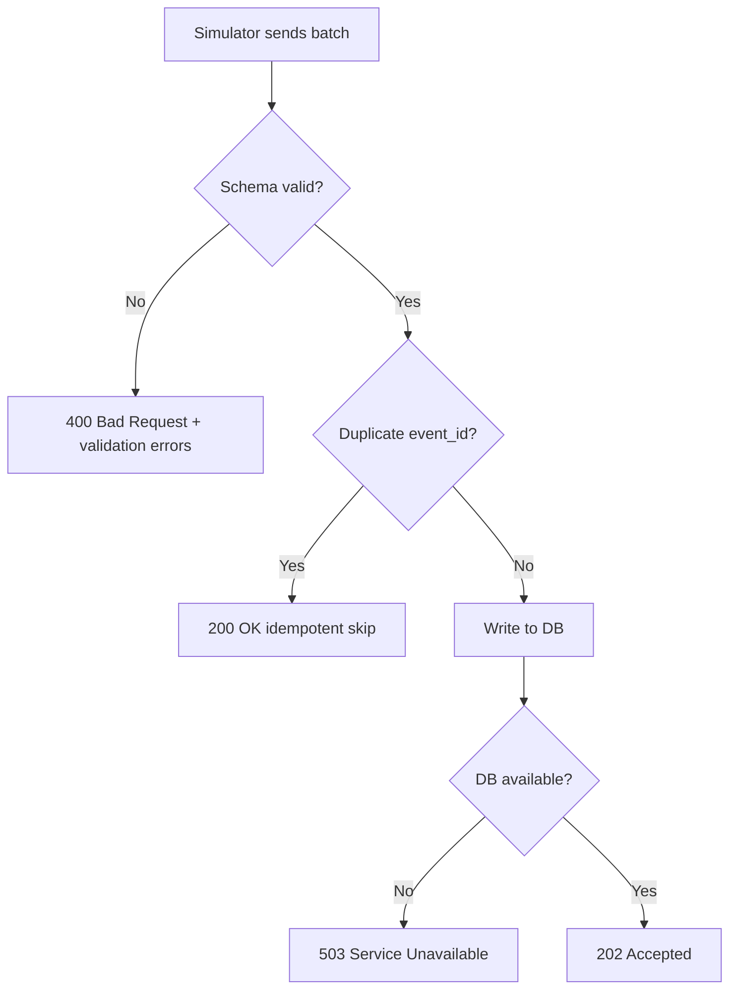

# User Flow — Feature 1: Simulator + Ingestion

**Status:** Complete (Phase 2)

---

## Goal

Replay demo scenarios that simulate industrial sensor readings, permit activity, and worker locations. Events are ingested through the API, normalized, stored in Postgres/TimescaleDB, and published to Redis for downstream risk evaluation.

---

## Actors

| Actor | Role |
|---|---|
| **Demo Simulator** | Python script/container replaying JSON/CSV scenarios |
| **Operator** | Views ingestion status on the dashboard |
| **FastAPI Backend** | Validates, normalizes, persists events |
| **Postgres/TimescaleDB** | Stores relational and time-series data |
| **Redis** | Publishes ingest events for async consumers |

---

## Primary Flow

---

## Scenario: Compound Risk Demo

File: `simulator/scenarios/compound_risk_demo.json`

The demo scenario stages events that will later trigger compound risk rules:

1. **Gas readings** — LEL sensor values rise in a confined zone
2. **Hot-work permit** — Active permit issued for the same zone
3. **Worker location** — Worker enters the confined zone

Each event type maps to a canonical schema before persistence.

---

## Event Types

| Type | Source | Stored In |
|---|---|---|
| `sensor_reading` | SCADA/IoT simulator | `sensor_readings` hypertable |
| `permit_update` | Permit system simulator | `permits` |
| `worker_location` | RTLS/badge simulator | `worker_locations` |

All raw payloads are also logged to `raw_events` for audit and replay.

---

## API Endpoints

| Method | Path | Purpose |
|---|---|---|
| `POST` | `/api/v1/ingest/events` | Batch ingest (202 Accepted) |
| `GET` | `/api/v1/sensors/latest` | Latest readings per sensor/zone |

---

## Dashboard: Ingestion Status Panel

Minimal UI elements for Feature 1:

- Last event timestamp
- Total events ingested (session counter)
- Active scenario name
- Scenario selector (when multiple scenarios exist)

---

## Error Paths

---

## Test Gate

Before moving to Feature 2:

- [x] Unit: schema validation rejects malformed payloads
- [x] Integration: ingest batch → rows appear in DB (requires `INTEGRATION_TESTS=1`)
- [x] E2E: simulator replays scenario → dashboard polls ingestion status

---

## Document History

| Date | Change |
|---|---|
| 2026-07-02 | Initial user flow (Phase 0) |
