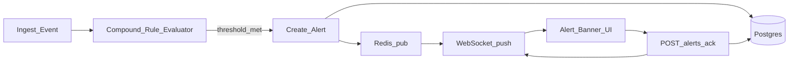
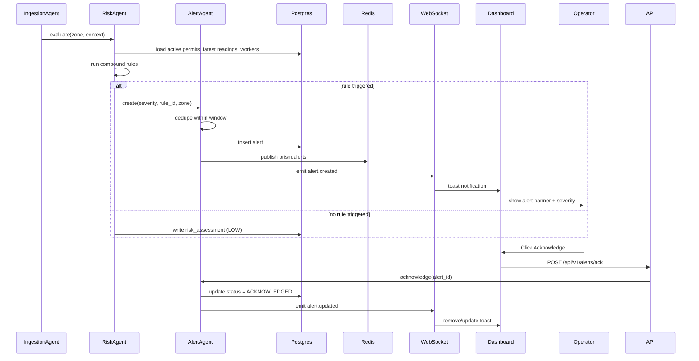

# User Flow — Feature 2: Risk Engine + Alerts

**Status:** Complete (Phase 3)

---

## Goal

Evaluate compound risk conditions deterministically (no LLM) when events are ingested. When thresholds are met, create alerts, publish to Redis, and push notifications to the dashboard via WebSocket. Operators can acknowledge alerts.

---

## Actors

| Actor | Role |
|---|---|
| **IngestionAgent** | Triggers risk evaluation after each ingest batch |
| **RiskAgent** | Runs compound rule evaluator |
| **AlertAgent** | Dedupes, prioritizes, persists, and routes alerts |
| **Operator** | Sees alert toasts, acknowledges active alerts |
| **Redis** | Pub/sub for alert and risk events |
| **WebSocket** | Real-time push to frontend |

---

## Primary Flow

---

## Detailed Sequence

---

## Compound Rules (v1)

Deterministic rules defined in `backend/api_contract.yaml`:

| Rule ID | Condition | Severity |
|---|---|---|
| **HotWorkGasSpike** | Active hot-work permit + LEL > threshold in same zone | HIGH |
| **ConfinedSpaceOccupancy** | Confined-space permit + worker count > 0 + O2 below threshold | CRITICAL |
| **PermitZoneMismatch** | Worker location outside permitted zone polygon | MEDIUM |

---

## API Endpoints

| Method | Path | Purpose |
|---|---|---|
| `GET` | `/api/v1/risk/active` | Active risk assessments by zone |
| `POST` | `/api/v1/alerts/ack` | Acknowledge an alert |
| `WS` | `/ws/alerts` | Real-time alert and risk events |

### WebSocket Events

| Event | When |
|---|---|
| `alert.created` | New alert persisted |
| `alert.updated` | Alert acknowledged or resolved |
| `risk.changed` | Zone risk level changes |

---

## Dashboard: Alert UI

- Toast list for incoming alerts (severity-colored)
- Acknowledge button per alert
- Active risk summary card (zones at HIGH/CRITICAL)
- Alert strip persists until acknowledged or resolved

---

## Dedup Logic

Alerts for the same `(rule_id, zone_id)` within a configurable window (e.g., 5 minutes) are suppressed rather than creating duplicates.

---

## Error Paths

| Condition | Behavior |
|---|---|
| DB unavailable during rule eval | Log error; ingest still succeeds; retry via Redis subscriber |
| WebSocket client disconnected | Alerts persisted; client catches up on reconnect via `GET /risk/active` |
| Invalid ack request | 404 if alert not found; 409 if already acknowledged |

---

## Test Gate

Before moving to Feature 3:

- [x] Unit: each rule fires with fixture data; each rule silent with safe data
- [x] Integration: compound_risk_demo scenario triggers expected alert (requires `INTEGRATION_TESTS=1`)
- [x] WebSocket: client receives `alert.created` event
- [x] UI: alert visible and acknowledgeable

---

## Document History

| Date | Change |
|---|---|
| 2026-07-02 | Initial user flow (Phase 0) |
