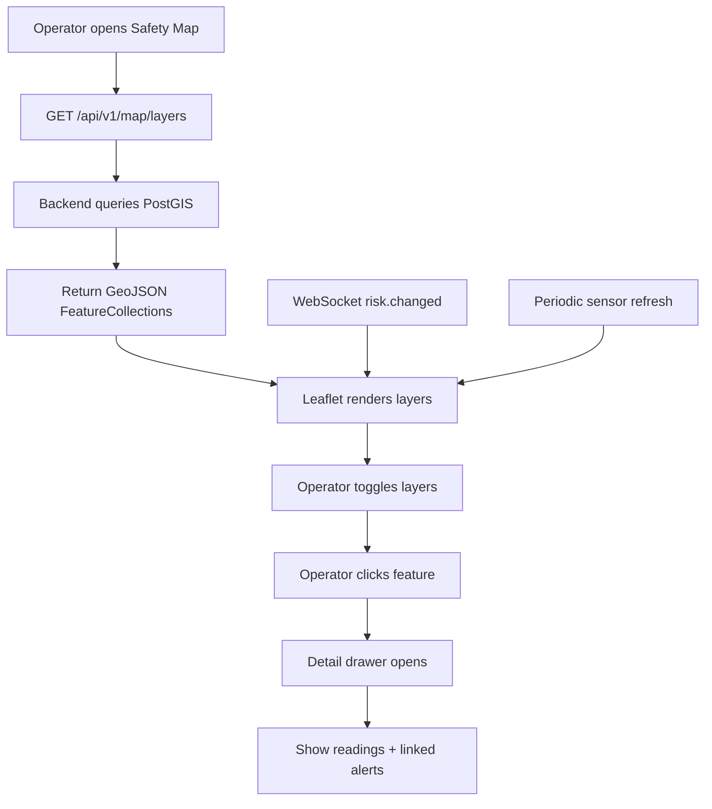
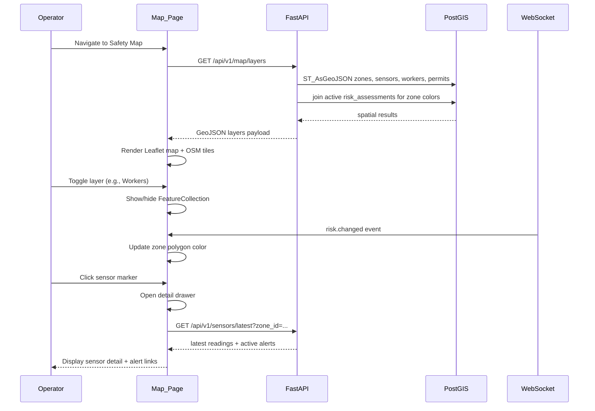

# User Flow — Feature 3: Geospatial Safety Map + Dashboard

**Status:** Complete (Phase 4)

---

## Goal

Provide an operations dashboard with a Leaflet-based safety map showing facility zones, live sensor markers, active permits, worker locations, and risk-colored zones. Operators click features to open a detail drawer with readings and linked alerts.

---

## Actors

| Actor | Role |
|---|---|
| **Operator** | Navigates map, toggles layers, inspects features |
| **FastAPI Backend** | Serves GeoJSON layers from PostGIS |
| **PostGIS** | Spatial queries and geometry storage |
| **Frontend** | Leaflet map, layer toggles, detail drawer |
| **WebSocket** | Live updates for markers and risk colors |

---

## Primary Flow



---

## Detailed Sequence



---

## Map Layers

| Layer | Geometry | Style |
|---|---|---|
| **Zones** | Polygon | Fill color by active risk level |
| **Sensors** | Point | Heat marker; color by reading vs threshold |
| **Permits** | Point/polygon | Icon by permit type; active vs expired |
| **Workers** | Point | Pin with worker ID label |
| **Assets** | Point | Equipment markers (optional toggle) |

### Risk Color Scale

| Risk Level | Color |
|---|---|
| LOW | Green |
| MEDIUM | Yellow |
| HIGH | Orange |
| CRITICAL | Red |

Colors defined as constants in `backend/api_contract.yaml`.

---

## API Endpoints

| Method | Path | Purpose |
|---|---|---|
| `GET` | `/api/v1/map/layers` | GeoJSON FeatureCollections for all layers |
| `GET` | `/api/v1/sensors/latest` | Latest readings (also used in detail drawer) |
| `GET` | `/api/v1/risk/active` | Active risk by zone (for color sync) |

---

## Unified Dashboard Layout

After Feature 3, the frontend combines:

```
┌─────────────────────────────────────────────┐
│  Nav: Dashboard | Safety Map | Incidents    │
├─────────────────────────────────────────────┤
│  Alert Strip (active unacked alerts)        │
├──────────────────┬──────────────────────────┤
│  Ingestion Panel │  Safety Map (Leaflet)    │
│  - last event    │  - layer toggles         │
│  - event count   │  - risk-colored zones    │
│  - scenario      │  - live markers          │
└──────────────────┴──────────────────────────┘
```

---

## Detail Drawer

When an operator clicks a map feature:

| Feature Type | Drawer Content |
|---|---|
| Zone | Zone name, active risk, linked alerts, permit list |
| Sensor | Latest reading, unit, threshold status, 24h sparkline (future) |
| Worker | Worker ID, zone, timestamp, linked permit |
| Permit | Type, status, time window, authorized zone polygon |

---

## Live Updates

1. **WebSocket** — `risk.changed` and `alert.created` update zone colors and alert strip
2. **Polling** — Sensor markers refresh every N seconds (configurable, default 10s)
3. **On ingest** — New worker/ permit markers appear on next layer fetch or push

---

## Error Paths

| Condition | Behavior |
|---|---|
| Invalid GeoJSON from API | Map shows error banner; retry button |
| Tile server unavailable | Leaflet fallback message; map pan/zoom still works |
| Empty layers | Show "No data" overlay with link to start simulator |

---

## Test Gate

Before moving to Feature 4:

- [x] API returns valid GeoJSON (schema validation)
- [x] Frontend component test: layers render with mock data
- [x] Integration: map layers return zone polygons (requires `INTEGRATION_TESTS=1`)
- [x] Zone color reflects risk level from assessments

---

## Document History

| Date | Change |
|---|---|
| 2026-07-02 | Initial user flow (Phase 0) |
