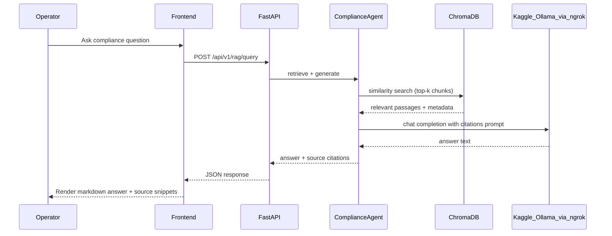
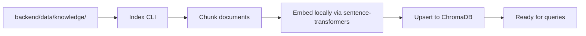
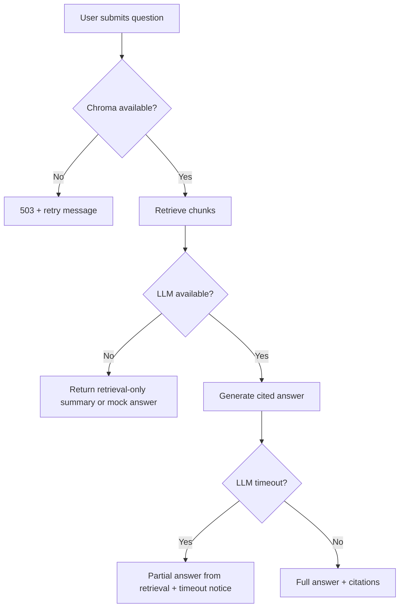

# User Flow — Feature 4: RAG Incident & Compliance Intelligence

**Status:** Complete (Phase 5)

---

## Goal

Let operators ask natural-language questions about SOPs, regulations, and past incidents. The system retrieves relevant document chunks from ChromaDB, generates a cited answer via the remote LLM (Ollama on Kaggle through ngrok), and displays the response in an Incident Intelligence chat UI.

---

## Actors

| Actor | Role |
|---|---|
| **Operator** | Asks compliance questions in chat UI |
| **ComplianceAgent** | Orchestrates retrieval + generation |
| **ChromaDB** | Vector store for embedded knowledge chunks |
| **LLM (Kaggle/Ollama)** | Chat completion with retrieved context |
| **FastAPI Backend** | `POST /api/v1/rag/query` endpoint |
| **Indexer CLI** | `python -m app.rag.index` — chunk, embed, upsert |

---

## Primary Flow



---

## Indexing Flow (Setup / Re-index)



Knowledge seed documents (OSS-safe text):

- Sample SOPs (hot work, confined space entry)
- OSHA excerpt summaries
- Past incident report summaries

Embeddings run **locally** to avoid Kaggle dependency during indexing. Only chat completion calls the remote LLM.

---

## Mock Mode (Offline Dev / CI)

When `LLM_BASE_URL` is empty:

- LLM client returns canned RAG answers
- Retrieval still works against Chroma (or fixture chunks in unit tests)
- Enables full test suite without ngrok

---

## API Endpoint

| Method | Path | Purpose |
|---|---|---|
| `POST` | `/api/v1/rag/query` | Natural-language query with session ID |

### Request (preview)

```yaml
query: string          # User question
session_id: string     # Conversation continuity
top_k: integer         # Retrieval count (default 5)
```

### Response (preview)

```yaml
answer: string         # Markdown-formatted answer
sources:
  - document_id: string
    title: string
    excerpt: string
    score: float
session_id: string
```

---

## Frontend: Incident Intelligence Page

- Chat-style UI with message history
- Markdown rendering for answers
- Expandable source citation cards (document title, excerpt, relevance score)
- Links to related active alerts/incidents when context matches
- Session persistence across questions

---

## LLM Integration

| Setting | Source |
|---|---|
| `LLM_BASE_URL` | `.env` — ngrok URL from Kaggle notebook |
| `LLM_MODEL` | `.env` — e.g., `llama3.2` |

Backend client (`backend/app/services/llm_client.py`):

- OpenAI-compatible `/v1/chat/completions` calls
- Timeout and retry with graceful degradation
- Mock fallback when URL unset

---

## Structured Incident Records

Beyond chat, the DB stores structured incident data for future correlation:

| Table | Purpose |
|---|---|
| `incidents` | Title, status, occurred_at |
| `incident_evidence` | Linked documents, sensor snapshots, alert IDs |

RAG answers can reference and link to these records when relevant.

---

## Error Paths



---

## Example Questions (Demo)

- "What are the hot work permit requirements before starting welding?"
- "What is the minimum oxygen level for confined space entry?"
- "What happened in the compound gas spike incident?"

Seeded knowledge docs should return cited answers for these in both live and mock mode.

---

## Test Gate

Before moving to optional CV or finalize:

- [x] Unit: retriever returns expected chunk for known query
- [x] Unit: LLM client mock mode returns cited answer via RAG service
- [x] Integration: full query path (requires `INTEGRATION_TESTS=1`)
- [ ] Manual: live ngrok path returns cited answer for seeded SOP question

---

## Document History

| Date | Change |
|---|---|
| 2026-07-02 | Initial user flow (Phase 0) |
