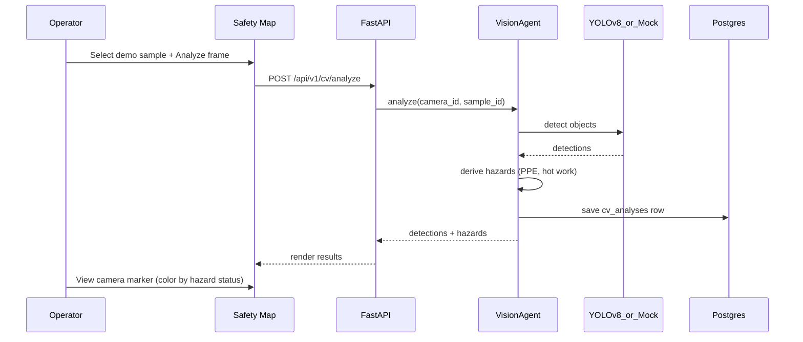

# User Flow — Feature 5 (Optional): CCTV Computer Vision

**Status:** Complete (Phase 6)

---

## Goal

Analyze demo CCTV frames for PPE violations and hot-work hazards. Results persist per camera and appear as color-coded markers on the Safety Map.

---

## Actors

| Actor | Role |
|---|---|
| **Operator** | Selects demo sample and runs analysis from Safety Map page |
| **VisionAgent** | Orchestrates frame analysis and DB persistence |
| **YOLOv8 (optional)** | Live object detection when `CV_ENABLED=true` |
| **Mock CV** | Deterministic detections when live model disabled (default) |
| **FastAPI Backend** | `GET /api/v1/cv/samples`, `POST /api/v1/cv/analyze` |
| **Safety Map** | Camera layer with hazard status overlay |

---

## Primary Flow

---

## Demo Samples

| sample_id | Expected hazards |
|---|---|
| `compliant_worker` | None |
| `no_ppe_worker` | PPE_VIOLATION (HIGH) |
| `hot_work_scene` | HOT_WORK_DETECTED (HIGH) |

---

## Map Overlay

- **cameras** GeoJSON layer on `GET /api/v1/map/layers`
- Marker color from `cv_hazard_colors`: normal / warning / critical
- Click camera → drawer shows last analysis hazards

---

## Configuration

| Variable | Default | Purpose |
|---|---|---|
| `CV_ENABLED` | `false` | Enable live YOLOv8 inference |
| `CV_MODEL` | `yolov8n.pt` | Ultralytics model path/name |

Mock mode works without GPU and is the recommended demo path.

---

## Test Gate

- [x] Unit: hazard derivation, mock detections, sample catalog
- [x] Contract: `cv_samples`, `cv_analyze` endpoints registered
- [x] Manual: analyze `no_ppe_worker` → camera marker turns warning on map
